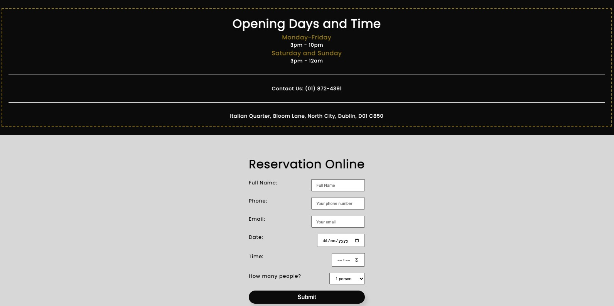
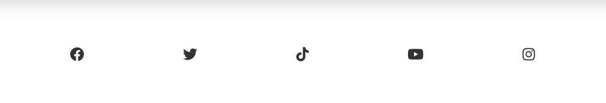

# **Hero Pizza**

**Visit [Hero Pizza](https://roddersnz21.github.io/project-1/)**

## **Purpose** ##

Hero Pizza is a family owned Italian pizzeria based in Dublin 15 for over 20 years. We are passionate about Napoliatn style pizza and aim to deliver the best pizza in Dublin. Our supplier are locally sourced in Ireland and we use fresh and organic produce and flour. We use state of the art woodfie oven from Italy giving the typical Naepolitan crispy crust and soft pizza.   This website has our history, pizza menu, contact details and a booking form.

## **User Stories** ##

- As a customer I want an objective and easy to use navbar menu
- As a customer I would like to read the history of the restaurant
- As a customer I want to choose a pizza from the menu
- As a customer I want to check pizza prices
- As a customer I want to check opening days and hours
- As a customer I want to check the address and contact number
- As a customer I want to make a booking
- As a customer I want confirmation of my booking

## **Features**

- ### Navigation Bar
    
    - Navigation bar indicates different sections of the website
    - Navigation bar is always visible
    - Navigation bar links will highlight red when hovered
    - Navigtion bar has a shadow and opacity effect

- ### Hero image and slogan
    
    - Background image with linear gradient effect
    - Slogan inside a box to grab users attention and overlay text reinforcing business' authenticity
    - Menu button with hover effect will take user to menu section after clicking it

- ### About Us
    
    - Section with image and info about history and ingredients used to make pizza
    - Text divided into two seperate paragraphs to giving good visual effect, short and easy to read

- ### Menu
    
    - Images, description and price of six types of pizza
    - Images are circled in the shape of pizzas

- ### Booking
    
    - Booking section in a grid display separated in two
    - One box includes restaurant's opening days and times, contact number and address
    - Other box is a form with fields for full name, phone number, email, date, time and number of people.
    - Submit button has a hover effect and shadow
    - Once submit button is clicked, it'll take user to confirmation page

- ### Footer
    
    - Footer section with five clickable social media icons
    - Icons have hover effect

- ### Confirmation page
    
    - This page confirms user's booking after submitting form

- ### Responsive Design

  **Mobile phone** iPhone 6/7/8/Plus

  

  **Tablet** iPad

  
  - The website is designed to be easy to read on a laptop

  ## **Colors and Font** 
- Webpage will use colors below:
    - #fff
    - #000
    - #444
    - rgb(220, 220, 220)
    - #998100

- Box shadow, button, hover and euro price colors below:
    - #aaa
    - rgba(0, 0, 0, 0.1)
    - rgba(0, 0, 0, 0.3)
    - rgba(0, 0, 0, 0.95)
    - #313131
    - #f1f1f1
    - #e84401

- Showcase area has a linear gradient color below:
    - rgba(240, 240, 240, 0.144), rgba(255, 255, 255, 0.336)

- The font for the entire webpage is [Poppins](https://fonts.google.com/specimen/Poppins)

## **Wireframe**

- My initial wireframe was for single page website but as the project evolved I decided to go for a rolling website. I believe it's faster to access information, imerses customers to the website's story and it's optimised for mobiles.

## **Testing** 

### **Code validation**
- W3C HTML Validator 
    - 
    - 

- W3C CSS Validator 
    - 

### **Lighthouse**
- Lighthouse desktop 
    - 
    - 

- Lighthouse mobile 
    - 
    - 

### **Test cases** 
 

  - **`As a customer I want an objective and easy to use navbar menu`** 
    - Navigation Bar
        - Navbar always visible when scrolling and easier for user to click on menu links. Links will take you to each section of website and hover over function shows which link user is about to click
        
          

  - **`As a customer I want to make a booking`**
    - Booking section
        - Text fields are required to be filled for form submission
        
         
        - Form filled correctly
        
          

  - **`As a customer I want confirmation of my booking`**
    - Confirmation page
        - After filling the form correctly and hitting submit button a new page opens confirming your booking
        

