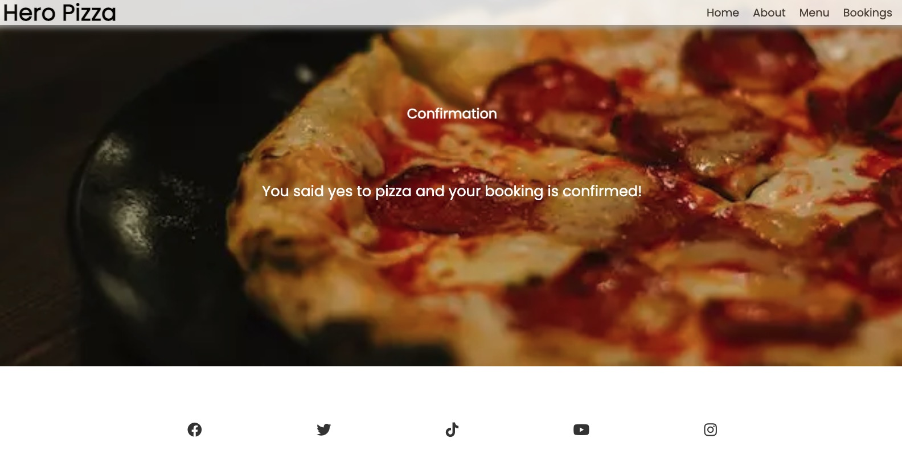

# **Hero Pizza**
 

## **Purpose** ##

Hero Pizza is a family owned Italian pizzeria based in Dublin 15 for over 20 years. We are passionate about Neapolitan style pizza and aim to deliver the best pizza in Dublin. Our suppliers are locally sourced in Ireland and we use fresh and organic produce and flour. Our state of the art wood fire oven comes from Italy giving the typical Neapolitan crispy crust and soft pizza.   This website has about us, pizza menu, contact details and booking form sections with a confirmation page after booking is successful.

**Visit [Hero Pizza](https://roddersnz21.github.io/project-1/)**

## **User Stories** ##

- As a customer I want an objective and easy to use navbar menu
- As a customer I want to read the history of the restaurant
- As a customer I want to see the menu and prices
- As a customer I want to check opening days, hours, address and contact number
- As a customer I want to make a booking
- As a customer I want confirmation of my booking

## **Wireframe**

- My initial wireframe was for single page website but as the project evolved I decided to go for a rolling website. I believe it's faster to access information, imerses users to the website's story and it's optimised for mobiles.

## **Features**

- ### Features Table
    

- ### Navigation Bar
    
    - Navigation bar indicates different sections of the website
    - Navigation bar is always visible
    - Navigation bar links will highlight red when hovered
    - Navigtion bar has a shadow and opacity effect

- ### Hero image and slogan
    
    - Background image with linear gradient effect
    - Slogan inside a box to grab users attention and overlay text reinforcing business' authenticity
    - Menu button with hover effect will take user to menu section after clicking it

- ### About Us
    
    - Section with image and info about our history to add value and ingredients used to gain users confidence dining with us
    - Text divided into two separate paragraphs with an image on right hand side giving good visual effect, short and easy to read

- ### Menu
    
    - Images, description and price of six types of pizza
    - Images are circled in the shape of pizzas
    - This section is in constant change as we update our menu during the year

- ### Booking
    
    - Booking section in a grid display
    - One box includes restaurant's opening days and times, contact number and address
    - Other box is a form with fields for full name, phone number, email, date, time and number of people.
    - Submit button has a hover effect and shadow
    - Once submit button is clicked, it'll take user to confirmation page

- ### Footer
    
    - Footer section with five clickable social media icons
    - Icons have hover effect

- ### Confirmation page
    
    - This page confirms user's booking after submitting form

- ### Responsive Design

  **Mobile phone** iPhone 6/7/8/Plus

  

  **Tablet** iPad

  

  **Laptop** MacBook Air

  
  - The website is designed to be easy to read on a laptop
  
  ## **Colors and Font** 
- Website uses colors below:
    - #fff
    - #000
    - #444
    - rgb(220, 220, 220)
    - #998100

- Box shadow, button, hover and euro price colors below:
    - #aaa
    - rgba(0, 0, 0, 0.1)
    - rgba(0, 0, 0, 0.3)
    - rgba(0, 0, 0, 0.95)
    - #313131
    - #f1f1f1
    - #e84401

- Showcase area has a linear gradient color below:
    - rgba(240, 240, 240, 0.144), rgba(255, 255, 255, 0.336)

- The font for the entire webpage is [Poppins](https://fonts.google.com/specimen/Poppins)

## **Testing** 

### **Code validation**
- W3C HTML Validator 
    - index.html page validator
    - 
     
    - confirmation.html page validator
    - 

- W3C CSS Validator 
    - style.css validator
    - 

### **Lighthouse**
- Lighthouse desktop index.html
    - 
     
- Lighthouse desktop confirmation.html
    - 

- Lighthouse mobile index.html
    - 
     
- Lighthouse mobile confirmation.html
    - 

### **Test cases** 
 

- ### User Stories Table
    

  - **`As a customer I want an objective and easy to use navbar menu`** 
    - Navigation Bar
        - Navbar always visible when scrolling and easier for user to click on menu links. Links will take you to each section of website and hover over function shows which link user is about to click
        
          

  - **`As a customer I would like to read the history of the restaurant`**
    - About Us Section
        - A brief history of the restaurant, fresh ingredients used and image of wood oven
        
          

  - **`As a customer I want to see the menu and prices`**
    - Pizza Menu Section
        - Circle image of six different pizzas including description of their ingredients and prices
        
          

  - **`As a customer I want to check opening days, hours, address and contact number`**
    - Booking Section
        - Upper container has opening days, times, phone number and restaurant address
        
          

  - **`As a customer I want to make a booking`**
    - Booking Section
        - Lower container is a form with text fields required to be filled for form submission
        
         
        - Form filled correctly
        
          

  - **`As a customer I want confirmation of my booking`**
    - Confirmation Page
        - After filling the form correctly and hitting submit button a new page opens confirming your booking
        
      
- **Testing the website on Safari and Firefox browser**
    - Website works in Chrome 109.0.5414.87
        
      
    - Website works in Safari 16.1
        
      
    - Website works in Firefox 108.0.2
        

### Fixed Bugs
  - W3C validator indicated two errors in index.html
    
    - Fixed error and ran validator again successfully with no errors or warnings
      
  - W3C validator indicated no errors but one warning in style.css
    
    - No necessary action on warning

### Technology
- **Balsamiq**
  - Used Balsamiq wireframes to draw initial stage of project
- **VS Code**
  - Used VS Code as my source code editor
- **GitPod**
  - Used GitPod as my open source application to write code 
- **GitHub**
  - Used GitHub as my cloud based Git repository to store code
- **GitHub Pages**
  - Used GitHub Pages as my static site hosting service
- **Chrome DevTools**
  - Used Google Chrome DevTools to inspect, edit, debug and test my code and measure HTML and CSS files performance

## Supported screens and browsers
  - For this web page different screen sizes were tested and no errors were found. This specific sizes were validated
    - **Mobile** 414x736 iPhone 6/7/8 Plus
      - Below 640px media queries will adapt website to smaller screens
    - **Tablet** 768x1024 iPad
    - **Desktop** 1920x1024
  - Browsers 
    - Google Chrome
    - Firefox
    - Safari

## **Deployment**
 ### GitHub Pages
- Deploy site in GitHub pages following steps below:
- In the GitHub repository, navigate and click Settings link
- In the menu on the left hand side navigate and click on Pages link
- From the Source section select Deploy from a branch drop-down menu
- From the Branch section select main and root from the drop-down menu and click on Save
- After a couple of minutes the page will refresh with a detailed display saying your website is live and link in blue indicating successful deployment
- The live link can be found here - https://roddersnz21.github.io/project-1/

### GitPod
  - Website was coded using GitPod. The steps to deploy are below:
  - In the GitHub repository, press the green GitPod button for transfer the project to GitPod environment

## **Credits**

  ### Content
  - Forno 500 Italian Restaurant [information](https://www.forno500.ie/)
  ### Media
 - I used pictures from [Pexel](https://www.pexels.com/search/pizza/)
 - I used icons from [Fontawesome](https://fontawesome.com/)
 - I used [Poppins](https://fonts.google.com/specimen/Poppins) from Google Fonts

  ### Other
  - Ideas and support from various sites, tutors and Code Institute network below:
  - [LoveRunning](https://github.com/Code-Institute-Solutions/love-running-2.0-sourcecode) project was of great help for implementing Navbar and Footer code
  - [W3schools](https://www.w3schools.com/w3css/w3css_web_tmp_pizza.asp) was a good source for troubleshooting whenever I had issues with my code
  - [Codewithrandom](https://www.codewithrandom.com/2022/08/05/restaurant-website-html-css/) help me set my website structure, overall look and code
  - [KevinPowell](https://www.youtube.com/@KevinPowell) Kevin's YouTube channel great source of support understanding flexbox, grid and troubleshooting
  - [TraversyMedia](https://www.youtube.com/@TraversyMedia) Traversy Media YouTube channel also a great source of support and troubleshooting especially with CSS
  - [Developedbyed](https://www.youtube.com/@developedbyed) Developedbyed YouTube channel gave me inspiration to try different ideas as well as troubleshooting
  - [CSSTricks](https://css-tricks.com/) CSS Tricks helped me fix my CSS code throughout the project
  - [Code Institute student template](https://github.com/Code-Institute-Org/gitpod-full-template) template for Gitpod was used for this project
  - Mentor **Dick Vlaanderen** helped and inspired me to try different approaches to this project
  - Cohort Facilitator **Paul Thomas** for his patience and support with us beginners as well as his consistency at chairing weekly catchups online and genuine interest in our projects 
  - Slack forum for support

[def]: docs/user-table.jpg